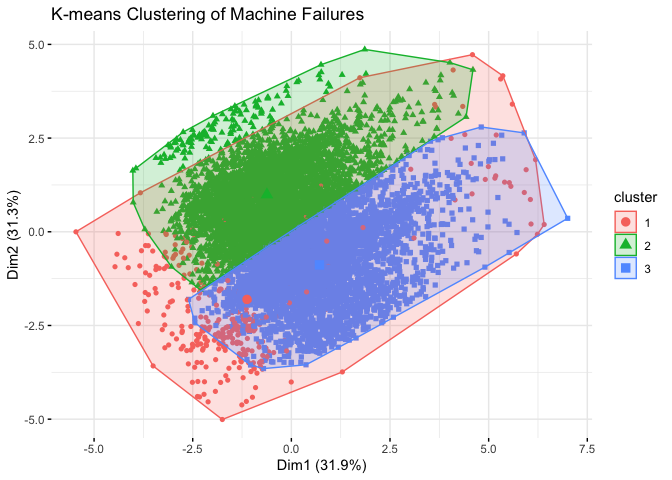
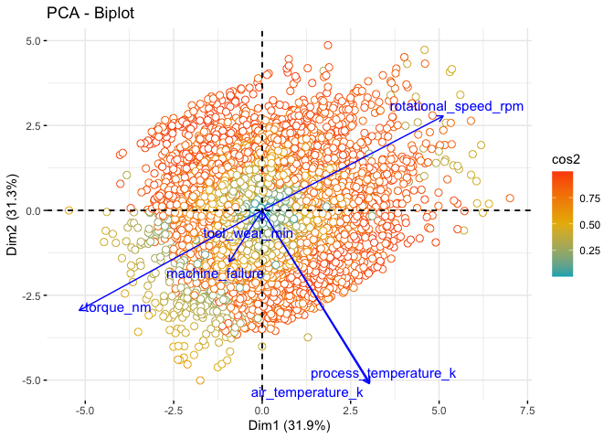
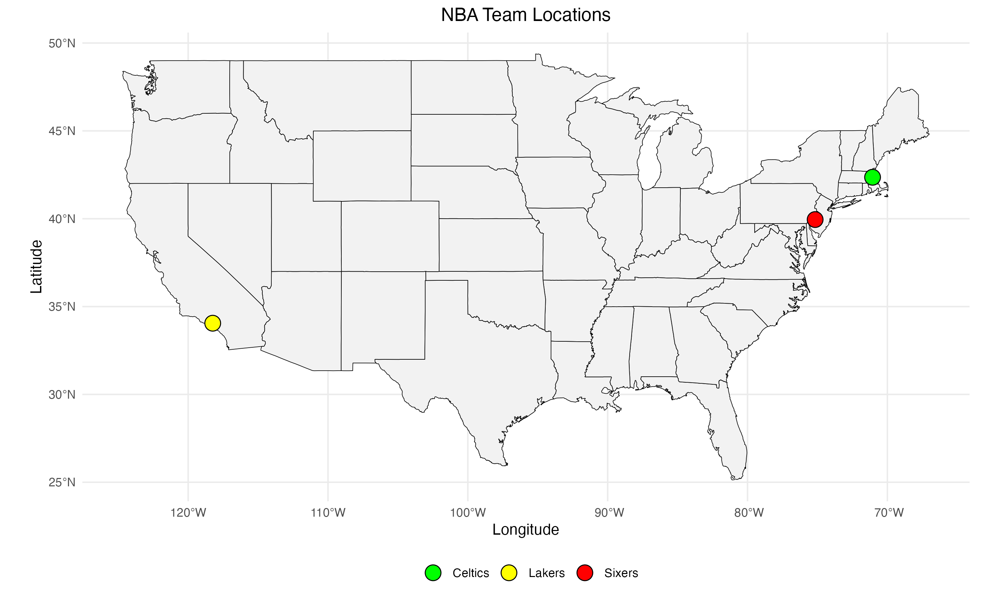
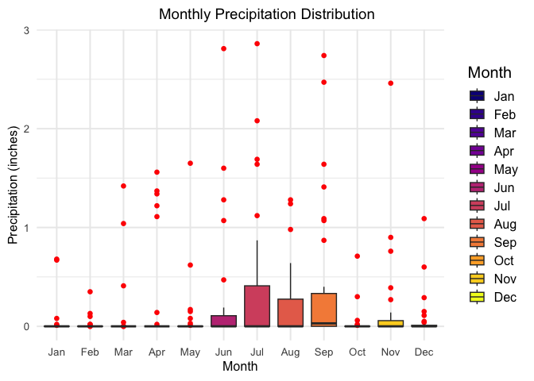
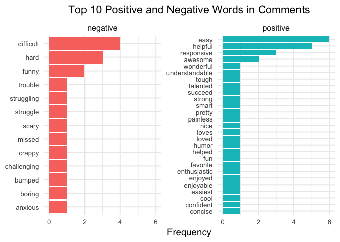
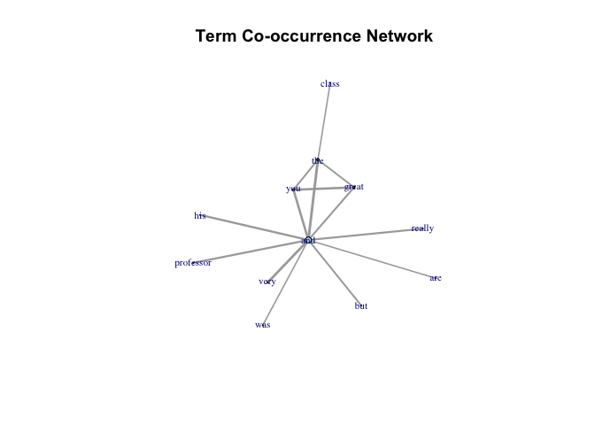
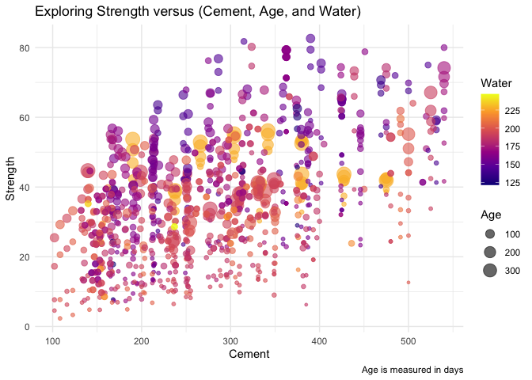

# Data Visualization and Reproducible Research

> Marckenrold Cadet

Learn more about me on my [GitHub profile page](https://github.com/mcadetxx).

The following is a sample of products created during the _"Data Visualization and Reproducible Research"_ course.

## Project 01: Data Visualization | Mini-Project 01

### Introduction
In industrial manufacturing, machine failures can lead to:

- Significant downtime
- Reduced productivity
- Increased maintenance costs

### Objectives
This project aims to:

- Analyze machine failure data to uncover patterns and trends
- Inform maintenance strategies
- Improve overall machine performance

### Key Analyses
- **Exploratory Data Analysis (EDA):** Initial data inspection and summary statistics
- **K-means Clustering:** Identifying groups of machines with similar failure patterns
- **Principal Component Analysis (PCA):** Reducing dimensionality to understand data structure
- **Gaussian Distribution:** Checking if key variables follow a normal distribution
- **ROC Curve Analysis:** Evaluating the performance of a machine failure prediction model
- **Six Sigma Control Charts:** Monitoring machine performance over time

### Sample Data Visualizations:

- **K-means Clustering:**   
  

- **Principal Component Analysis:**
  

## Project 02: Data Visualization Project 02

### Introduction
The National Basketball Association (NBA) is a premier professional basketball league. Analyzing team performance and statistics can provide insights into:

- Game strategies
- Player effectiveness
- Overall team success

### Objectives
This project focuses on:

- Exploring various facets of NBA teams' performance
- Analyzing key metrics
- Providing an in-depth analysis of team statistics

### Key Analyses
- **Interactive Plot:** Total points by Celtics in home and away games
- **Spatial Visualization:** NBA team locations
- **Linear Model Visualization:** Relationship between defensive rebounds and points scored

### Sample Data Visualizations:

- **Map of NBA Team Locations:**
  

- **Impact of Defensive Rebounds on Points:** 
  [View Interactive Visualization](project-02/model_coefficients_interactive.html)

## Project 03: Data Visualization for Exploratory Data Analysis

### Introduction
Data visualization is a critical tool in exploratory data analysis (EDA). It helps:

- Understand data
- Identify patterns
- Spot anomalies
- Derive insights

### Datasets Used
- **Weather Data:** Florida Climate Center, Tampa International Airport (TPA) for 2022
- **Text Data:** RateMyProfessors comments
- **Civil Engineering Data:** Concrete Strength

### Key Visualizations

#### Weather Data
- **Density Plots:** Distribution of maximum temperatures
- **Histogram Facets:** Monthly variations in temperature distributions
- **Ridge Plots:** Temperature distribution across different months
- **Boxplots:** Monthly distribution of precipitation values

**Sample Data Visualizations:**

- **Tampa Monthly Precipitation:**
  

#### Text Data
- **Bigram Frequency Plot:** Commonly occurring word pairs
- **Sentiment Analysis:** Identifying positive and negative words
- **Word Cloud:** Visualization of most frequent words
- **Term Co-occurrence Network:** Relationships between commonly occurring terms

**Sample Data Visualizations:**

- **Course Evaluation Frequent Words:**
  

- **Network Sentiment Analysis:**   
  

#### Concrete Strength
- **Concrete Age in Days**   
  
  
### Moving Forward

Reflecting on this course, I have learned:

- The importance of data visualization in uncovering insights
- Effective communication of findings through visualizations
- The value of reproducible research practices

Future plans include:

- Exploring advanced visualization techniques
- Enhancing data storytelling skills
- Ensuring all research practices remain reproducible
