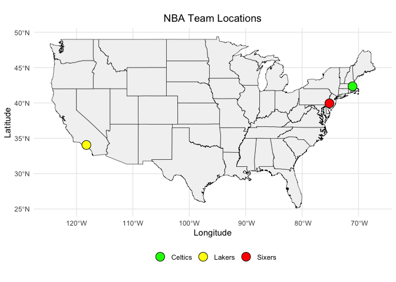

# Data Visualization Project 02

# Introduction


The National Basketball Association (NBA) is one of the premier professional basketball leagues in the world. Analyzing team performance and statistics can provide insights into game strategies, player effectiveness, and overall team success. This report aims to explore various facets of NBA teams' performance, focusing on key metrics and providing an in-depth analysis of team statistics.

# Background

The NBA consists of 30 teams divided into two conferences: the Eastern Conference and the Western Conference. Each team plays an 82-game regular season, with the top eight teams from each conference advancing to the playoffs. Winning an NBA championship is the ultimate goal for any team `(We are Champion - Celtics ☘️)`, requiring not just skill but also effective strategies and consistent performance.

# Methodology

This analysis utilizes data from the NBA champions dataset, which includes various statistics for NBA teams. We will use R for data manipulation, visualization, and statistical analysis. The key areas of focus will include per game statistics, advanced statistics, and shooting statistics, providing a comprehensive overview of team performance.


```r
# load libraries
library(tidyverse)
```

```
## ── Attaching core tidyverse packages ──────────────────────── tidyverse 2.0.0 ──
## ✔ dplyr     1.1.3     ✔ readr     2.1.4
## ✔ forcats   1.0.0     ✔ stringr   1.5.0
## ✔ ggplot2   3.4.3     ✔ tibble    3.2.1
## ✔ lubridate 1.9.2     ✔ tidyr     1.3.0
## ✔ purrr     1.0.2     
## ── Conflicts ────────────────────────────────────────── tidyverse_conflicts() ──
## ✖ dplyr::filter() masks stats::filter()
## ✖ dplyr::lag()    masks stats::lag()
## ℹ Use the conflicted package (<http://conflicted.r-lib.org/>) to force all conflicts to become errors
```

```r
library(sf)
```

```
## Warning: package 'sf' was built under R version 4.3.2
```

```
## Linking to GEOS 3.11.0, GDAL 3.5.3, PROJ 9.1.0; sf_use_s2() is TRUE
```

```r
library(plotly)
```

```
## 
## Attaching package: 'plotly'
## 
## The following object is masked from 'package:ggplot2':
## 
##     last_plot
## 
## The following object is masked from 'package:stats':
## 
##     filter
## 
## The following object is masked from 'package:graphics':
## 
##     layout
```

```r
library(htmlwidgets)
library(broom)
```


```r
# load data
file_path <- "https://raw.githubusercontent.com/reisanar/datasets/master/NBAchampionsdata.csv"
data <- read_csv(file_path)
```

```
## Rows: 220 Columns: 24
## ── Column specification ────────────────────────────────────────────────────────
## Delimiter: ","
## chr  (1): Team
## dbl (23): Year, Game, Win, Home, MP, FG, FGA, FGP, TP, TPA, TPP, FT, FTA, FT...
## 
## ℹ Use `spec()` to retrieve the full column specification for this data.
## ℹ Specify the column types or set `show_col_types = FALSE` to quiet this message.
```

```r
data
```

```
## # A tibble: 220 × 24
##     Year Team     Game   Win  Home    MP    FG   FGA   FGP    TP   TPA    TPP
##    <dbl> <chr>   <dbl> <dbl> <dbl> <dbl> <dbl> <dbl> <dbl> <dbl> <dbl>  <dbl>
##  1  1980 Lakers      1     1     1   240    48    89 0.539     0     0 NA    
##  2  1980 Lakers      2     0     1   240    48    95 0.505     0     1  0    
##  3  1980 Lakers      3     1     0   240    44    92 0.478     0     1  0    
##  4  1980 Lakers      4     0     0   240    44    93 0.473     0     0 NA    
##  5  1980 Lakers      5     1     1   240    41    91 0.451     0     0 NA    
##  6  1980 Lakers      6     1     0   240    45    92 0.489     0     2  0    
##  7  1981 Celtics     1     1     1   240    41    95 0.432     0     1  0    
##  8  1981 Celtics     2     0     1   240    41    82 0.5       0     3  0    
##  9  1981 Celtics     3     1     0   240    40    89 0.449     2     3  0.667
## 10  1981 Celtics     4     0     0   240    35    74 0.473     0     3  0    
## # ℹ 210 more rows
## # ℹ 12 more variables: FT <dbl>, FTA <dbl>, FTP <dbl>, ORB <dbl>, DRB <dbl>,
## #   TRB <dbl>, AST <dbl>, STL <dbl>, BLK <dbl>, TOV <dbl>, PF <dbl>, PTS <dbl>
```

Check the summary statistics and structure of the dataset, and look for missing values:

```r
# Summary statistics 
summary(data)
```

```
##       Year          Team                Game          Win        
##  Min.   :1980   Length:220         Min.   :1.0   Min.   :0.0000  
##  1st Qu.:1989   Class :character   1st Qu.:2.0   1st Qu.:0.0000  
##  Median :1999   Mode  :character   Median :3.0   Median :1.0000  
##  Mean   :1999                      Mean   :3.4   Mean   :0.7091  
##  3rd Qu.:2009                      3rd Qu.:5.0   3rd Qu.:1.0000  
##  Max.   :2018                      Max.   :7.0   Max.   :1.0000  
##                                                                  
##       Home              MP              FG             FGA        
##  Min.   :0.0000   Min.   :240.0   Min.   :25.00   Min.   : 62.00  
##  1st Qu.:0.0000   1st Qu.:240.0   1st Qu.:33.00   1st Qu.: 75.00  
##  Median :1.0000   Median :240.0   Median :37.00   Median : 80.00  
##  Mean   :0.5045   Mean   :242.4   Mean   :37.75   Mean   : 80.88  
##  3rd Qu.:1.0000   3rd Qu.:240.0   3rd Qu.:42.00   3rd Qu.: 87.00  
##  Max.   :1.0000   Max.   :315.0   Max.   :56.00   Max.   :130.00  
##                                                                   
##       FGP               TP              TPA             TPP        
##  Min.   :0.2890   Min.   : 0.000   Min.   : 0.00   Min.   :0.0000  
##  1st Qu.:0.4298   1st Qu.: 2.000   1st Qu.: 6.75   1st Qu.:0.2500  
##  Median :0.4670   Median : 5.000   Median :15.00   Median :0.3585  
##  Mean   :0.4665   Mean   : 5.355   Mean   :14.60   Mean   :0.3422  
##  3rd Qu.:0.5000   3rd Qu.: 8.000   3rd Qu.:20.00   3rd Qu.:0.4440  
##  Max.   :0.6170   Max.   :18.000   Max.   :43.00   Max.   :1.0000  
##                                                    NA's   :6       
##        FT             FTA             FTP              ORB      
##  Min.   : 5.00   Min.   : 8.00   Min.   :0.3680   Min.   : 3.0  
##  1st Qu.:15.00   1st Qu.:21.00   1st Qu.:0.6670   1st Qu.: 9.0  
##  Median :19.00   Median :26.00   Median :0.7400   Median :12.0  
##  Mean   :19.93   Mean   :27.13   Mean   :0.7356   Mean   :12.3  
##  3rd Qu.:24.00   3rd Qu.:32.25   3rd Qu.:0.8157   3rd Qu.:15.0  
##  Max.   :43.00   Max.   :57.00   Max.   :1.0000   Max.   :27.0  
##                                                                 
##       DRB             TRB            AST            STL        
##  Min.   :16.00   Min.   :22.0   Min.   :11.0   Min.   : 1.000  
##  1st Qu.:27.00   1st Qu.:38.0   1st Qu.:18.0   1st Qu.: 6.000  
##  Median :30.00   Median :42.0   Median :22.0   Median : 8.000  
##  Mean   :30.20   Mean   :42.5   Mean   :22.5   Mean   : 7.855  
##  3rd Qu.:33.25   3rd Qu.:47.0   3rd Qu.:27.0   3rd Qu.:10.000  
##  Max.   :44.00   Max.   :59.0   Max.   :44.0   Max.   :18.000  
##                                                                
##       BLK              TOV              PF             PTS        
##  Min.   : 0.000   Min.   : 4.00   Min.   :12.00   Min.   : 71.00  
##  1st Qu.: 3.000   1st Qu.:11.00   1st Qu.:20.00   1st Qu.: 90.75  
##  Median : 5.000   Median :14.00   Median :23.00   Median :101.00  
##  Mean   : 5.323   Mean   :13.71   Mean   :22.86   Mean   :100.79  
##  3rd Qu.: 7.000   3rd Qu.:16.00   3rd Qu.:26.00   3rd Qu.:109.00  
##  Max.   :14.000   Max.   :26.00   Max.   :33.00   Max.   :141.00  
## 
```

```r
# Structure the dataset
str(data)
```

```
## spc_tbl_ [220 × 24] (S3: spec_tbl_df/tbl_df/tbl/data.frame)
##  $ Year: num [1:220] 1980 1980 1980 1980 1980 ...
##  $ Team: chr [1:220] "Lakers" "Lakers" "Lakers" "Lakers" ...
##  $ Game: num [1:220] 1 2 3 4 5 6 1 2 3 4 ...
##  $ Win : num [1:220] 1 0 1 0 1 1 1 0 1 0 ...
##  $ Home: num [1:220] 1 1 0 0 1 0 1 1 0 0 ...
##  $ MP  : num [1:220] 240 240 240 240 240 240 240 240 240 240 ...
##  $ FG  : num [1:220] 48 48 44 44 41 45 41 41 40 35 ...
##  $ FGA : num [1:220] 89 95 92 93 91 92 95 82 89 74 ...
##  $ FGP : num [1:220] 0.539 0.505 0.478 0.473 0.451 0.489 0.432 0.5 0.449 0.473 ...
##  $ TP  : num [1:220] 0 0 0 0 0 0 0 0 2 0 ...
##  $ TPA : num [1:220] 0 1 1 0 0 2 1 3 3 3 ...
##  $ TPP : num [1:220] NA 0 0 NA NA 0 0 0 0.667 0 ...
##  $ FT  : num [1:220] 13 8 23 14 26 33 16 8 12 16 ...
##  $ FTA : num [1:220] 15 12 30 19 33 35 20 13 19 24 ...
##  $ FTP : num [1:220] 0.867 0.667 0.767 0.737 0.788 0.943 0.8 0.615 0.632 0.667 ...
##  $ ORB : num [1:220] 12 15 22 18 19 17 25 14 16 17 ...
##  $ DRB : num [1:220] 31 37 34 31 37 35 29 34 28 30 ...
##  $ TRB : num [1:220] 43 52 56 49 56 52 54 48 44 47 ...
##  $ AST : num [1:220] 30 32 20 23 28 27 23 17 24 22 ...
##  $ STL : num [1:220] 5 12 5 12 7 14 6 6 12 5 ...
##  $ BLK : num [1:220] 9 7 5 6 6 4 5 7 6 6 ...
##  $ TOV : num [1:220] 17 26 20 19 21 17 19 22 11 22 ...
##  $ PF  : num [1:220] 24 27 25 22 27 22 21 27 25 22 ...
##  $ PTS : num [1:220] 109 104 111 102 108 123 98 90 94 86 ...
##  - attr(*, "spec")=
##   .. cols(
##   ..   Year = col_double(),
##   ..   Team = col_character(),
##   ..   Game = col_double(),
##   ..   Win = col_double(),
##   ..   Home = col_double(),
##   ..   MP = col_double(),
##   ..   FG = col_double(),
##   ..   FGA = col_double(),
##   ..   FGP = col_double(),
##   ..   TP = col_double(),
##   ..   TPA = col_double(),
##   ..   TPP = col_double(),
##   ..   FT = col_double(),
##   ..   FTA = col_double(),
##   ..   FTP = col_double(),
##   ..   ORB = col_double(),
##   ..   DRB = col_double(),
##   ..   TRB = col_double(),
##   ..   AST = col_double(),
##   ..   STL = col_double(),
##   ..   BLK = col_double(),
##   ..   TOV = col_double(),
##   ..   PF = col_double(),
##   ..   PTS = col_double()
##   .. )
##  - attr(*, "problems")=<externalptr>
```

```r
# Check for missing values
colSums(is.na(data))
```

```
## Year Team Game  Win Home   MP   FG  FGA  FGP   TP  TPA  TPP   FT  FTA  FTP  ORB 
##    0    0    0    0    0    0    0    0    0    0    0    6    0    0    0    0 
##  DRB  TRB  AST  STL  BLK  TOV   PF  PTS 
##    0    0    0    0    0    0    0    0
```

## Celtics Home and Away Wins

To analyze the home and away wins for the Boston Celtics:

```r
# make columns numeric
data <- data %>%
  mutate(across(c(Win, Home, DRB), as.numeric))

# Filter data for Celtics
celtics_data <- data %>% filter(Team == "Celtics")

# Summarize home and away wins
celtics_home_away <- celtics_data %>%
  summarise(HomeWins = sum(ifelse(Home == 1 & Win == 1, 1, 0), na.rm = TRUE),
            AwayWins = sum(ifelse(Home == 0 & Win == 1, 1, 0), na.rm = TRUE))

celtics_home_away
```

```
## # A tibble: 1 × 2
##   HomeWins AwayWins
##      <dbl>    <dbl>
## 1       11        5
```

# Analysis 1: Interactive Plot


```r
# convert columns to numeric
data <- data %>%
  mutate(across(c(Win, Home, DRB, PTS), as.numeric))

# Filter data for Celtics - favorite basketball team
celtics_data <- data %>% filter(Team == "Celtics")

# Getting sum of total points by Celtics in home and away games
celtics_points <- celtics_data %>%
  group_by(Home) %>%
  summarise(TotalPoints = sum(PTS, na.rm = TRUE))

# Create interactive plot
p <- celtics_points %>%
  ggplot(aes(x = factor(Home, labels = c("Away", "Home")), y = TotalPoints, fill = factor(Home))) +
  geom_bar(stat = "identity") +
  labs(
    title = "Total Points by Celtics in Home and Away Games",
    subtitle = "Total points scored by the Celtics in home and away games.",
    x = "Game Location",
    y = "Total Points"
  ) +
  scale_fill_manual(values = c("Away" = "blue", "Home" = "red")) +
  theme_minimal() +
  theme(
    plot.title = element_text(hjust = 0.5, face = "bold"),
    plot.subtitle = element_text(hjust = 0.5),
    axis.title.x = element_text(face = "bold"),
    axis.title.y = element_text(face = "bold"),
    legend.title = element_blank()
  )

# Add interactive elements with plotly
interactive_plot <- ggplotly(p, tooltip = c("x", "y"))

# Customize hover text
interactive_plot <- interactive_plot %>%
  layout(
    hoverlabel = list(
      bgcolor = "white",
      bordercolor = "black",
      font = list(size = 12)
    )
  )

# show plot
interactive_plot
```

```{=html}
<div class="plotly html-widget html-fill-item" id="htmlwidget-619782e7448df62d3d7b" style="width:672px;height:480px;"></div>
<script type="application/json" data-for="htmlwidget-619782e7448df62d3d7b">{"x":{"data":[{"orientation":"v","width":0.89999999999999991,"base":0,"x":[1],"y":[1205],"text":"factor(Home, labels = c(\"Away\", \"Home\")): Away<br />TotalPoints: 1205","type":"bar","textposition":"none","marker":{"autocolorscale":false,"color":"rgba(127,127,127,1)","line":{"width":1.8897637795275593,"color":"transparent"}},"name":"0","legendgroup":"0","showlegend":true,"xaxis":"x","yaxis":"y","hoverinfo":"text","frame":null},{"orientation":"v","width":0.90000000000000013,"base":0,"x":[2],"y":[1445],"text":"factor(Home, labels = c(\"Away\", \"Home\")): Home<br />TotalPoints: 1445","type":"bar","textposition":"none","marker":{"autocolorscale":false,"color":"rgba(127,127,127,1)","line":{"width":1.8897637795275593,"color":"transparent"}},"name":"1","legendgroup":"1","showlegend":true,"xaxis":"x","yaxis":"y","hoverinfo":"text","frame":null}],"layout":{"margin":{"t":43.762557077625573,"r":7.3059360730593621,"b":40.182648401826498,"l":48.949771689497723},"font":{"color":"rgba(0,0,0,1)","family":"","size":14.611872146118724},"title":{"text":"<b> Total Points by Celtics in Home and Away Games <\/b>","font":{"color":"rgba(0,0,0,1)","family":"","size":17.534246575342465},"x":0.5,"xref":"paper"},"xaxis":{"domain":[0,1],"automargin":true,"type":"linear","autorange":false,"range":[0.40000000000000002,2.6000000000000001],"tickmode":"array","ticktext":["Away","Home"],"tickvals":[1,2],"categoryorder":"array","categoryarray":["Away","Home"],"nticks":null,"ticks":"","tickcolor":null,"ticklen":3.6529680365296811,"tickwidth":0,"showticklabels":true,"tickfont":{"color":"rgba(77,77,77,1)","family":"","size":11.68949771689498},"tickangle":-0,"showline":false,"linecolor":null,"linewidth":0,"showgrid":true,"gridcolor":"rgba(235,235,235,1)","gridwidth":0.66417600664176002,"zeroline":false,"anchor":"y","title":{"text":"<b> Game Location <\/b>","font":{"color":"rgba(0,0,0,1)","family":"","size":14.611872146118724}},"hoverformat":".2f"},"yaxis":{"domain":[0,1],"automargin":true,"type":"linear","autorange":false,"range":[-72.25,1517.25],"tickmode":"array","ticktext":["0","500","1000","1500"],"tickvals":[0,500,1000,1500],"categoryorder":"array","categoryarray":["0","500","1000","1500"],"nticks":null,"ticks":"","tickcolor":null,"ticklen":3.6529680365296811,"tickwidth":0,"showticklabels":true,"tickfont":{"color":"rgba(77,77,77,1)","family":"","size":11.68949771689498},"tickangle":-0,"showline":false,"linecolor":null,"linewidth":0,"showgrid":true,"gridcolor":"rgba(235,235,235,1)","gridwidth":0.66417600664176002,"zeroline":false,"anchor":"x","title":{"text":"<b> Total Points <\/b>","font":{"color":"rgba(0,0,0,1)","family":"","size":14.611872146118724}},"hoverformat":".2f"},"shapes":[{"type":"rect","fillcolor":null,"line":{"color":null,"width":0,"linetype":[]},"yref":"paper","xref":"paper","x0":0,"x1":1,"y0":0,"y1":1}],"showlegend":true,"legend":{"bgcolor":null,"bordercolor":null,"borderwidth":0,"font":{"color":"rgba(0,0,0,1)","family":"","size":11.68949771689498},"title":{"text":"","font":{"color":null,"family":null,"size":0}}},"hovermode":"closest","barmode":"relative","hoverlabel":{"bgcolor":"white","bordercolor":"black","font":{"size":12}}},"config":{"doubleClick":"reset","modeBarButtonsToAdd":["hoverclosest","hovercompare"],"showSendToCloud":false},"source":"A","attrs":{"e08f571ae706":{"x":{},"y":{},"fill":{},"type":"bar"}},"cur_data":"e08f571ae706","visdat":{"e08f571ae706":["function (y) ","x"]},"highlight":{"on":"plotly_click","persistent":false,"dynamic":false,"selectize":false,"opacityDim":0.20000000000000001,"selected":{"opacity":1},"debounce":0},"shinyEvents":["plotly_hover","plotly_click","plotly_selected","plotly_relayout","plotly_brushed","plotly_brushing","plotly_clickannotation","plotly_doubleclick","plotly_deselect","plotly_afterplot","plotly_sunburstclick"],"base_url":"https://plot.ly"},"evals":[],"jsHooks":[]}</script>
```

```r
# Save hrml plot
saveWidget(interactive_plot, file = "celtics_points_interactive.html")
```

# Analysis 2: Spatial Visualization


```r
# looking into specific team by locations and team colors
team_locations <- data.frame(
  Team = c("Lakers", "Celtics", "Sixers"),
  City = c("Los Angeles", "Boston", "Philadelphia"),
  Latitude = c(34.0522, 42.3601, 39.9526),
  Longitude = c(-118.2437, -71.0589, -75.1652),
  Color = c("yellow", "green", "red")
)

# Convert to spatial 
team_locations <- st_as_sf(team_locations, coords = c("Longitude", "Latitude"), crs = 4326)

# Get US map data
us_map <- map_data("state")

# plot
spatial_plot <- ggplot() +
  geom_polygon(data = us_map, aes(x = long, y = lat, group = group), fill = "gray95", color = "black", linewidth = 0.2) +
  geom_sf(data = team_locations, aes(geometry = geometry, fill = Team), size = 5, shape = 21, color = "black") +
  scale_fill_manual(values = c("Lakers" = "yellow", "Celtics" = "green", "Sixers" = "red")) +
  labs(title = "NBA Team Locations", x = "Longitude", y = "Latitude") +
  theme_minimal() +
  theme(
    legend.position = "bottom",
    legend.title = element_blank(),
    plot.title = element_text(hjust = 0.5)
  )

spatial_plot
```

<!-- -->

```r
# Save plot
ggsave("nba_team_locations.png", plot = spatial_plot, width = 10, height = 6)
```

# Analysis 3: Visualization of a Model

In this section, we will build a linear model to explore the relationship between defensive rebounds (DRB) and points scored (PTS) by NBA teams. Understanding this relationship can help teams improve their defensive strategies to increase their chances of scoring and winning games.


```r
# Ensure columns are numeric
data <- data %>%
  mutate(across(c(Win, Home, DRB, PTS), as.numeric))

# Linear Model and Coefficients Plot
model <- lm(PTS ~ DRB, data = data)
model_summary <- summary(model)

# Get the coefficients and their confidence intervals
coef_data <- broom::tidy(model) %>%
  mutate(term = recode(term, `(Intercept)` = "Intercept", `DRB` = "Defensive Rebounds"))

# Create interactive plot with hover annotations
coef_plot <- coef_data %>%
  ggplot(aes(x = term, y = estimate, fill = term, text = paste(
    "Term: ", term, "<br>",
    "Estimate: ", round(estimate, 2), "<br>",
    "Std Error: ", round(std.error, 2), "<br>",
    "This plot shows the relationship between defensive rebounds and points scored.<br>",
    "The bars represent the estimated coefficients, and the lines represent the uncertainty around these estimates."
  ))) +
  geom_col(width = 0.6) +
  geom_errorbar(aes(ymin = estimate - std.error, ymax = estimate + std.error), width = 0.2) +
  scale_fill_manual(values = c("Defensive Rebounds" = "#1f77b4", "Intercept" = "#ff7f0e")) +
  labs(
    title = "Impact of Defensive Rebounds on Points Scored",
    subtitle = "Linear Model Coefficients with Error Bars",
    x = "Model Terms",
    y = "Coefficient Estimate"
  ) +
  theme_minimal() +
  theme(
    plot.title = element_text(hjust = 0.5, face = "bold"),
    plot.subtitle = element_text(hjust = 0.5)
  )

interactive_plot <- ggplotly(coef_plot, tooltip = "text") %>%
  layout(margin = list(t = 80))  # Adjust top margin

# Residuals Plot
residuals_data <- augment(model)
residuals_plot <- residuals_data %>%
  ggplot(aes(x = .fitted, y = .resid, text = paste(
    "Fitted Value: ", round(.fitted, 2), "<br>",
    "Residual: ", round(.resid, 2)
  ))) +
  geom_point(color = "#1f77b4") +
  geom_hline(yintercept = 0, linetype = "dashed") +
  labs(
    title = "Residuals vs Fitted Values",
    x = "Fitted Values",
   

 y = "Residuals"
  ) +
  theme_minimal() +
  theme(
    plot.title = element_text(hjust = 0.5, face = "bold")
  )

interactive_residuals_plot <- ggplotly(residuals_plot, tooltip = "text") %>%
  layout(margin = list(t = 80))  # Adjust top margin

# Save interactive plots in HTML format
saveWidget(interactive_plot, file = "model_coefficients_interactive.html")
saveWidget(interactive_residuals_plot, file = "residuals_plot_interactive.html")

# Show plots
interactive_plot
```

```{=html}
<div class="plotly html-widget html-fill-item" id="htmlwidget-3e147c472542bc1fa03c" style="width:672px;height:480px;"></div>
<script type="application/json" data-for="htmlwidget-3e147c472542bc1fa03c">{"x":{"data":[{"orientation":"v","width":0.60000000000000009,"base":0,"x":[1],"y":[0.42533466687182553],"text":"Term:  Defensive Rebounds <br> Estimate:  0.43 <br> Std Error:  0.18 <br> This plot shows the relationship between defensive rebounds and points scored.<br> The bars represent the estimated coefficients, and the lines represent the uncertainty around these estimates.","type":"bar","textposition":"none","marker":{"autocolorscale":false,"color":"rgba(31,119,180,1)","line":{"width":1.8897637795275593,"color":"transparent"}},"name":"Defensive Rebounds","legendgroup":"Defensive Rebounds","showlegend":true,"xaxis":"x","yaxis":"y","hoverinfo":"text","frame":null},{"orientation":"v","width":0.59999999999999987,"base":0,"x":[2],"y":[87.941256696834571],"text":"Term:  Intercept <br> Estimate:  87.94 <br> Std Error:  5.59 <br> This plot shows the relationship between defensive rebounds and points scored.<br> The bars represent the estimated coefficients, and the lines represent the uncertainty around these estimates.","type":"bar","textposition":"none","marker":{"autocolorscale":false,"color":"rgba(255,127,14,1)","line":{"width":1.8897637795275593,"color":"transparent"}},"name":"Intercept","legendgroup":"Intercept","showlegend":true,"xaxis":"x","yaxis":"y","hoverinfo":"text","frame":null},{"x":[1],"y":[0.42533466687182553],"text":"Term:  Defensive Rebounds <br> Estimate:  0.43 <br> Std Error:  0.18 <br> This plot shows the relationship between defensive rebounds and points scored.<br> The bars represent the estimated coefficients, and the lines represent the uncertainty around these estimates.","type":"scatter","mode":"lines","opacity":1,"line":{"color":"transparent"},"error_y":{"array":[0.18282414411102277],"arrayminus":[0.18282414411102274],"type":"data","width":15.272727272727288,"symmetric":false,"color":"rgba(0,0,0,1)"},"name":"Defensive Rebounds","legendgroup":"Defensive Rebounds","showlegend":false,"xaxis":"x","yaxis":"y","hoverinfo":"text","frame":null},{"x":[2],"y":[87.941256696834571],"text":"Term:  Intercept <br> Estimate:  87.94 <br> Std Error:  5.59 <br> This plot shows the relationship between defensive rebounds and points scored.<br> The bars represent the estimated coefficients, and the lines represent the uncertainty around these estimates.","type":"scatter","mode":"lines","opacity":1,"line":{"color":"transparent"},"error_y":{"array":[5.5923653275609553],"arrayminus":[5.5923653275609553],"type":"data","width":15.272727272727288,"symmetric":false,"color":"rgba(0,0,0,1)"},"name":"Intercept","legendgroup":"Intercept","showlegend":false,"xaxis":"x","yaxis":"y","hoverinfo":"text","frame":null}],"layout":{"margin":{"t":80,"r":7.3059360730593621,"b":40.182648401826498,"l":37.260273972602747},"font":{"color":"rgba(0,0,0,1)","family":"","size":14.611872146118724},"title":{"text":"<b> Impact of Defensive Rebounds on Points Scored <\/b>","font":{"color":"rgba(0,0,0,1)","family":"","size":17.534246575342465},"x":0.5,"xref":"paper"},"xaxis":{"domain":[0,1],"automargin":true,"type":"linear","autorange":false,"range":[0.40000000000000002,2.6000000000000001],"tickmode":"array","ticktext":["Defensive Rebounds","Intercept"],"tickvals":[1,2],"categoryorder":"array","categoryarray":["Defensive Rebounds","Intercept"],"nticks":null,"ticks":"","tickcolor":null,"ticklen":3.6529680365296811,"tickwidth":0,"showticklabels":true,"tickfont":{"color":"rgba(77,77,77,1)","family":"","size":11.68949771689498},"tickangle":-0,"showline":false,"linecolor":null,"linewidth":0,"showgrid":true,"gridcolor":"rgba(235,235,235,1)","gridwidth":0.66417600664176002,"zeroline":false,"anchor":"y","title":{"text":"Model Terms","font":{"color":"rgba(0,0,0,1)","family":"","size":14.611872146118724}},"hoverformat":".2f"},"yaxis":{"domain":[0,1],"automargin":true,"type":"linear","autorange":false,"range":[-4.6766811012197769,98.210303125615297],"tickmode":"array","ticktext":["0","25","50","75"],"tickvals":[0,25,50,75],"categoryorder":"array","categoryarray":["0","25","50","75"],"nticks":null,"ticks":"","tickcolor":null,"ticklen":3.6529680365296811,"tickwidth":0,"showticklabels":true,"tickfont":{"color":"rgba(77,77,77,1)","family":"","size":11.68949771689498},"tickangle":-0,"showline":false,"linecolor":null,"linewidth":0,"showgrid":true,"gridcolor":"rgba(235,235,235,1)","gridwidth":0.66417600664176002,"zeroline":false,"anchor":"x","title":{"text":"Coefficient Estimate","font":{"color":"rgba(0,0,0,1)","family":"","size":14.611872146118724}},"hoverformat":".2f"},"shapes":[{"type":"rect","fillcolor":null,"line":{"color":null,"width":0,"linetype":[]},"yref":"paper","xref":"paper","x0":0,"x1":1,"y0":0,"y1":1}],"showlegend":true,"legend":{"bgcolor":null,"bordercolor":null,"borderwidth":0,"font":{"color":"rgba(0,0,0,1)","family":"","size":11.68949771689498},"title":{"text":"term","font":{"color":"rgba(0,0,0,1)","family":"","size":14.611872146118724}}},"hovermode":"closest","barmode":"relative"},"config":{"doubleClick":"reset","modeBarButtonsToAdd":["hoverclosest","hovercompare"],"showSendToCloud":false},"source":"A","attrs":{"e08f160f4c26":{"x":{},"y":{},"fill":{},"text":{},"type":"bar"},"e08f46505e1a":{"x":{},"y":{},"fill":{},"text":{},"ymin":{},"ymax":{}}},"cur_data":"e08f160f4c26","visdat":{"e08f160f4c26":["function (y) ","x"],"e08f46505e1a":["function (y) ","x"]},"highlight":{"on":"plotly_click","persistent":false,"dynamic":false,"selectize":false,"opacityDim":0.20000000000000001,"selected":{"opacity":1},"debounce":0},"shinyEvents":["plotly_hover","plotly_click","plotly_selected","plotly_relayout","plotly_brushed","plotly_brushing","plotly_clickannotation","plotly_doubleclick","plotly_deselect","plotly_afterplot","plotly_sunburstclick"],"base_url":"https://plot.ly"},"evals":[],"jsHooks":[]}</script>
```

```r
interactive_residuals_plot
```

```{=html}
<div class="plotly html-widget html-fill-item" id="htmlwidget-436de9588f34a0e4c87e" style="width:672px;height:480px;"></div>
<script type="application/json" data-for="htmlwidget-436de9588f34a0e4c87e">{"x":{"data":[{"x":[101.12663136986116,103.67863937109212,102.40263537047664,101.12663136986116,103.67863937109212,102.82797003734846,100.27596203611751,102.40263537047664,99.850627369245686,100.70129670298934,102.82797003734846,99.850627369245686,101.12663136986116,97.298619368014727,101.12663136986116,101.97730070360481,97.72395403488656,102.40263537047664,101.55196603673299,99.850627369245686,101.55196603673299,99.850627369245686,100.70129670298934,100.70129670298934,99.425292702373866,98.574623368630213,104.10397403796394,99.850627369245686,101.55196603673299,99.425292702373866,102.82797003734846,103.25330470422028,101.12663136986116,100.27596203611751,101.55196603673299,101.55196603673299,100.27596203611751,101.12663136986116,100.27596203611751,99.425292702373866,101.97730070360481,100.70129670298934,98.999958035502033,98.14928870175838,101.12663136986116,97.72395403488656,101.12663136986116,97.298619368014727,102.82797003734846,101.97730070360481,98.999958035502033,94.746611366783782,99.850627369245686,101.12663136986116,103.25330470422028,97.298619368014727,100.70129670298934,99.425292702373866,102.82797003734846,100.27596203611751,98.999958035502033,99.425292702373866,99.850627369245686,100.70129670298934,98.574623368630213,100.70129670298934,100.27596203611751,99.425292702373866,99.850627369245686,101.12663136986116,101.97730070360481,98.999958035502033,98.14928870175838,97.298619368014727,101.12663136986116,98.999958035502033,101.55196603673299,100.70129670298934,99.425292702373866,99.425292702373866,103.67863937109212,96.873284701142907,101.97730070360481,98.999958035502033,99.425292702373866,101.55196603673299,100.70129670298934,101.55196603673299,100.27596203611751,102.82797003734846,101.97730070360481,97.72395403488656,98.574623368630213,97.72395403488656,96.873284701142907,98.574623368630213,99.425292702373866,98.999958035502033,100.70129670298934,99.425292702373866,99.850627369245686,101.55196603673299,102.82797003734846,101.55196603673299,95.597280700527435,104.52930870483577,99.425292702373866,96.447950034271088,95.171946033655601,101.97730070360481,103.25330470422028,98.999958035502033,102.82797003734846,101.12663136986116,102.40263537047664,103.25330470422028,98.574623368630213,99.850627369245686,96.873284701142907,101.12663136986116,99.850627369245686,103.67863937109212,100.70129670298934,101.12663136986116,101.97730070360481,101.97730070360481,102.82797003734846,101.97730070360481,101.55196603673299,103.67863937109212,100.27596203611751,100.27596203611751,101.12663136986116,101.12663136986116,106.6559820391949,99.425292702373866,99.425292702373866,103.25330470422028,103.25330470422028,100.70129670298934,102.40263537047664,99.425292702373866,99.425292702373866,101.55196603673299,98.999958035502033,100.70129670298934,100.70129670298934,101.97730070360481,98.14928870175838,101.97730070360481,105.80531270545124,98.999958035502033,105.80531270545124,100.70129670298934,102.40263537047664,102.40263537047664,102.40263537047664,103.25330470422028,99.425292702373866,101.12663136986116,102.40263537047664,98.999958035502033,102.40263537047664,104.95464337170759,101.12663136986116,94.746611366783782,100.27596203611751,102.40263537047664,100.70129670298934,100.27596203611751,101.55196603673299,98.999958035502033,95.597280700527435,104.95464337170759,100.70129670298934,100.70129670298934,100.70129670298934,100.70129670298934,100.27596203611751,97.298619368014727,100.70129670298934,99.850627369245686,100.27596203611751,101.12663136986116,101.12663136986116,101.97730070360481,103.67863937109212,99.425292702373866,99.425292702373866,102.40263537047664,97.298619368014727,100.70129670298934,101.55196603673299,102.40263537047664,98.999958035502033,98.14928870175838,101.55196603673299,102.40263537047664,103.67863937109212,102.82797003734846,99.850627369245686,104.10397403796394,101.55196603673299,101.55196603673299,101.55196603673299,98.574623368630213,102.82797003734846,98.14928870175838,101.97730070360481,103.67863937109212,104.52930870483577,103.25330470422028,106.23064737232306,103.25330470422028,98.14928870175838,100.27596203611751,102.40263537047664,102.40263537047664,101.12663136986116,102.40263537047664],"y":[7.8733686301388417,0.32136062890788253,8.597364629523355,0.8733686301388417,4.3213606289078825,20.172029962651536,-2.2759620361175052,-12.402635370476645,-5.8506273692456858,-14.701296702989339,6.1720299626515356,2.1493726307543142,22.873368630138842,-3.2986193680147267,27.873368630138842,9.0226992963951886,4.2760459651134397,11.597364629523355,11.448033963267008,3.1493726307543142,9.4480339632670081,15.149372630754314,14.298703297010661,23.298703297010661,4.5747072976261336,30.425376631369787,16.896025962036063,8.1493726307543142,9.4480339632670081,14.574707297626134,6.1720299626515356,32.746695295779716,3.8733686301388417,19.724037963882495,9.4480339632670081,10.448033963267008,16.724037963882495,2.8733686301388417,5.7240379638824948,-3.4252927023738664,9.0226992963951886,25.298703297010661,42.000041964497967,4.8507112982416203,5.8733686301388417,10.27604596511344,4.8733686301388417,-4.2986193680147267,5.1720299626515356,-2.9773007036048114,-12.999958035502033,-0.7466113667837817,3.1493726307543142,6.8733686301388417,5.7466952957797162,10.701380631985273,13.298703297010661,5.5747072976261336,2.1720299626515356,4.7240379638824948,22.000041964497967,12.574707297626134,-7.8506273692456858,-9.7012967029893389,8.4253766313697867,3.2987032970106611,-3.2759620361175052,8.5747072976261336,22.149372630754314,2.8733686301388417,-7.9773007036048114,-10.999958035502033,20.85071129824162,-0.29861936801472666,-1.1266313698611583,12.000041964497967,19.448033963267008,10.298703297010661,-1.4252927023738664,-0.4252927023738664,-18.678639371092117,-13.873284701142907,-8.9773007036048114,-16.999958035502033,-15.425292702373866,-15.551966036732992,-10.701296702989339,18.448033963267008,16.724037963882495,3.1720299626515356,11.022699296395189,9.2760459651134397,-6.5746233686302133,10.27604596511344,-10.873284701142907,-20.574623368630213,-12.425292702373866,-14.999958035502033,-3.7012967029893389,-6.4252927023738664,-26.850627369245686,-11.551966036732992,-12.827970037348464,-16.551966036732992,-2.5972807005274348,-8.5293087048357705,-13.425292702373866,-15.447950034271088,-8.1719460336556011,-12.977300703604811,-23.253304704220284,-17.999958035502033,-6.8279700373484644,-23.126631369861158,1.597364629523355,7.7466952957797162,-7.5746233686302133,20.149372630754314,-9.8732847011429072,14.873368630138842,1.1493726307543142,-5.6786393710921175,-4.7012967029893389,-1.1266313698611583,6.0226992963951886,-2.9773007036048114,3.1720299626515356,4.0226992963951886,11.448033963267008,-2.6786393710921175,-15.275962036117505,-16.275962036117505,-25.126631369861158,-8.1266313698611583,-18.655982039194896,-12.425292702373866,-8.4252927023738664,-15.253304704220284,-15.253304704220284,-0.70129670298933888,-18.402635370476645,-2.4252927023738664,-20.425292702373866,-30.551966036732992,-2.9999580355020328,-14.701296702989339,-19.701296702989339,-21.977300703604811,-13.14928870175838,-3.9773007036048114,-7.805312705451243,2.0000419644979672,-10.805312705451243,-15.701296702989339,0.59736462952335501,-27.402635370476645,-19.402635370476645,-5.2533047042202838,8.5747072976261336,-20.126631369861158,-5.402635370476645,-0.99995803550203277,28.597364629523355,-4.9546433717075899,-0.1266313698611583,9.2533886332162183,-1.2759620361175052,-3.402635370476645,1.2987032970106611,-6.2759620361175052,-10.551966036732992,-9.9999580355020328,-9.5972807005274348,-15.95464337170759,-17.701296702989339,-16.701296702989339,-5.7012967029893389,-14.701296702989339,-14.275962036117505,14.701380631985273,4.2987032970106611,-5.8506273692456858,-0.27596203611750525,-10.126631369861158,2.8733686301388417,19.022699296395189,-15.678639371092117,3.5747072976261336,-22.425292702373866,6.597364629523355,6.7013806319852733,2.2987032970106611,-6.5519660367329919,7.597364629523355,-2.9999580355020328,12.85071129824162,5.4480339632670081,1.597364629523355,4.3213606289078825,-9.8279700373484644,-8.8506273692456858,-1.1039740379639369,2.4480339632670081,3.4480339632670081,-12.551966036732992,-21.574623368630213,17.172029962651536,-1.1492887017583797,10.022699296395189,11.321360628907883,-11.529308704835771,9.7466952957797162,25.769352627676938,14.746695295779716,17.85071129824162,28.724037963882495,21.597364629523355,19.597364629523355,8.8733686301388417,5.597364629523355],"text":["Fitted Value:  101.13 <br> Residual:  7.87","Fitted Value:  103.68 <br> Residual:  0.32","Fitted Value:  102.4 <br> Residual:  8.6","Fitted Value:  101.13 <br> Residual:  0.87","Fitted Value:  103.68 <br> Residual:  4.32","Fitted Value:  102.83 <br> Residual:  20.17","Fitted Value:  100.28 <br> Residual:  -2.28","Fitted Value:  102.4 <br> Residual:  -12.4","Fitted Value:  99.85 <br> Residual:  -5.85","Fitted Value:  100.7 <br> Residual:  -14.7","Fitted Value:  102.83 <br> Residual:  6.17","Fitted Value:  99.85 <br> Residual:  2.15","Fitted Value:  101.13 <br> Residual:  22.87","Fitted Value:  97.3 <br> Residual:  -3.3","Fitted Value:  101.13 <br> Residual:  27.87","Fitted Value:  101.98 <br> Residual:  9.02","Fitted Value:  97.72 <br> Residual:  4.28","Fitted Value:  102.4 <br> Residual:  11.6","Fitted Value:  101.55 <br> Residual:  11.45","Fitted Value:  99.85 <br> Residual:  3.15","Fitted Value:  101.55 <br> Residual:  9.45","Fitted Value:  99.85 <br> Residual:  15.15","Fitted Value:  100.7 <br> Residual:  14.3","Fitted Value:  100.7 <br> Residual:  23.3","Fitted Value:  99.43 <br> Residual:  4.57","Fitted Value:  98.57 <br> Residual:  30.43","Fitted Value:  104.1 <br> Residual:  16.9","Fitted Value:  99.85 <br> Residual:  8.15","Fitted Value:  101.55 <br> Residual:  9.45","Fitted Value:  99.43 <br> Residual:  14.57","Fitted Value:  102.83 <br> Residual:  6.17","Fitted Value:  103.25 <br> Residual:  32.75","Fitted Value:  101.13 <br> Residual:  3.87","Fitted Value:  100.28 <br> Residual:  19.72","Fitted Value:  101.55 <br> Residual:  9.45","Fitted Value:  101.55 <br> Residual:  10.45","Fitted Value:  100.28 <br> Residual:  16.72","Fitted Value:  101.13 <br> Residual:  2.87","Fitted Value:  100.28 <br> Residual:  5.72","Fitted Value:  99.43 <br> Residual:  -3.43","Fitted Value:  101.98 <br> Residual:  9.02","Fitted Value:  100.7 <br> Residual:  25.3","Fitted Value:  99 <br> Residual:  42","Fitted Value:  98.15 <br> Residual:  4.85","Fitted Value:  101.13 <br> Residual:  5.87","Fitted Value:  97.72 <br> Residual:  10.28","Fitted Value:  101.13 <br> Residual:  4.87","Fitted Value:  97.3 <br> Residual:  -4.3","Fitted Value:  102.83 <br> Residual:  5.17","Fitted Value:  101.98 <br> Residual:  -2.98","Fitted Value:  99 <br> Residual:  -13","Fitted Value:  94.75 <br> Residual:  -0.75","Fitted Value:  99.85 <br> Residual:  3.15","Fitted Value:  101.13 <br> Residual:  6.87","Fitted Value:  103.25 <br> Residual:  5.75","Fitted Value:  97.3 <br> Residual:  10.7","Fitted Value:  100.7 <br> Residual:  13.3","Fitted Value:  99.43 <br> Residual:  5.57","Fitted Value:  102.83 <br> Residual:  2.17","Fitted Value:  100.28 <br> Residual:  4.72","Fitted Value:  99 <br> Residual:  22","Fitted Value:  99.43 <br> Residual:  12.57","Fitted Value:  99.85 <br> Residual:  -7.85","Fitted Value:  100.7 <br> Residual:  -9.7","Fitted Value:  98.57 <br> Residual:  8.43","Fitted Value:  100.7 <br> Residual:  3.3","Fitted Value:  100.28 <br> Residual:  -3.28","Fitted Value:  99.43 <br> Residual:  8.57","Fitted Value:  99.85 <br> Residual:  22.15","Fitted Value:  101.13 <br> Residual:  2.87","Fitted Value:  101.98 <br> Residual:  -7.98","Fitted Value:  99 <br> Residual:  -11","Fitted Value:  98.15 <br> Residual:  20.85","Fitted Value:  97.3 <br> Residual:  -0.3","Fitted Value:  101.13 <br> Residual:  -1.13","Fitted Value:  99 <br> Residual:  12","Fitted Value:  101.55 <br> Residual:  19.45","Fitted Value:  100.7 <br> Residual:  10.3","Fitted Value:  99.43 <br> Residual:  -1.43","Fitted Value:  99.43 <br> Residual:  -0.43","Fitted Value:  103.68 <br> Residual:  -18.68","Fitted Value:  96.87 <br> Residual:  -13.87","Fitted Value:  101.98 <br> Residual:  -8.98","Fitted Value:  99 <br> Residual:  -17","Fitted Value:  99.43 <br> Residual:  -15.43","Fitted Value:  101.55 <br> Residual:  -15.55","Fitted Value:  100.7 <br> Residual:  -10.7","Fitted Value:  101.55 <br> Residual:  18.45","Fitted Value:  100.28 <br> Residual:  16.72","Fitted Value:  102.83 <br> Residual:  3.17","Fitted Value:  101.98 <br> Residual:  11.02","Fitted Value:  97.72 <br> Residual:  9.28","Fitted Value:  98.57 <br> Residual:  -6.57","Fitted Value:  97.72 <br> Residual:  10.28","Fitted Value:  96.87 <br> Residual:  -10.87","Fitted Value:  98.57 <br> Residual:  -20.57","Fitted Value:  99.43 <br> Residual:  -12.43","Fitted Value:  99 <br> Residual:  -15","Fitted Value:  100.7 <br> Residual:  -3.7","Fitted Value:  99.43 <br> Residual:  -6.43","Fitted Value:  99.85 <br> Residual:  -26.85","Fitted Value:  101.55 <br> Residual:  -11.55","Fitted Value:  102.83 <br> Residual:  -12.83","Fitted Value:  101.55 <br> Residual:  -16.55","Fitted Value:  95.6 <br> Residual:  -2.6","Fitted Value:  104.53 <br> Residual:  -8.53","Fitted Value:  99.43 <br> Residual:  -13.43","Fitted Value:  96.45 <br> Residual:  -15.45","Fitted Value:  95.17 <br> Residual:  -8.17","Fitted Value:  101.98 <br> Residual:  -12.98","Fitted Value:  103.25 <br> Residual:  -23.25","Fitted Value:  99 <br> Residual:  -18","Fitted Value:  102.83 <br> Residual:  -6.83","Fitted Value:  101.13 <br> Residual:  -23.13","Fitted Value:  102.4 <br> Residual:  1.6","Fitted Value:  103.25 <br> Residual:  7.75","Fitted Value:  98.57 <br> Residual:  -7.57","Fitted Value:  99.85 <br> Residual:  20.15","Fitted Value:  96.87 <br> Residual:  -9.87","Fitted Value:  101.13 <br> Residual:  14.87","Fitted Value:  99.85 <br> Residual:  1.15","Fitted Value:  103.68 <br> Residual:  -5.68","Fitted Value:  100.7 <br> Residual:  -4.7","Fitted Value:  101.13 <br> Residual:  -1.13","Fitted Value:  101.98 <br> Residual:  6.02","Fitted Value:  101.98 <br> Residual:  -2.98","Fitted Value:  102.83 <br> Residual:  3.17","Fitted Value:  101.98 <br> Residual:  4.02","Fitted Value:  101.55 <br> Residual:  11.45","Fitted Value:  103.68 <br> Residual:  -2.68","Fitted Value:  100.28 <br> Residual:  -15.28","Fitted Value:  100.28 <br> Residual:  -16.28","Fitted Value:  101.13 <br> Residual:  -25.13","Fitted Value:  101.13 <br> Residual:  -8.13","Fitted Value:  106.66 <br> Residual:  -18.66","Fitted Value:  99.43 <br> Residual:  -12.43","Fitted Value:  99.43 <br> Residual:  -8.43","Fitted Value:  103.25 <br> Residual:  -15.25","Fitted Value:  103.25 <br> Residual:  -15.25","Fitted Value:  100.7 <br> Residual:  -0.7","Fitted Value:  102.4 <br> Residual:  -18.4","Fitted Value:  99.43 <br> Residual:  -2.43","Fitted Value:  99.43 <br> Residual:  -20.43","Fitted Value:  101.55 <br> Residual:  -30.55","Fitted Value:  99 <br> Residual:  -3","Fitted Value:  100.7 <br> Residual:  -14.7","Fitted Value:  100.7 <br> Residual:  -19.7","Fitted Value:  101.98 <br> Residual:  -21.98","Fitted Value:  98.15 <br> Residual:  -13.15","Fitted Value:  101.98 <br> Residual:  -3.98","Fitted Value:  105.81 <br> Residual:  -7.81","Fitted Value:  99 <br> Residual:  2","Fitted Value:  105.81 <br> Residual:  -10.81","Fitted Value:  100.7 <br> Residual:  -15.7","Fitted Value:  102.4 <br> Residual:  0.6","Fitted Value:  102.4 <br> Residual:  -27.4","Fitted Value:  102.4 <br> Residual:  -19.4","Fitted Value:  103.25 <br> Residual:  -5.25","Fitted Value:  99.43 <br> Residual:  8.57","Fitted Value:  101.13 <br> Residual:  -20.13","Fitted Value:  102.4 <br> Residual:  -5.4","Fitted Value:  99 <br> Residual:  -1","Fitted Value:  102.4 <br> Residual:  28.6","Fitted Value:  104.95 <br> Residual:  -4.95","Fitted Value:  101.13 <br> Residual:  -0.13","Fitted Value:  94.75 <br> Residual:  9.25","Fitted Value:  100.28 <br> Residual:  -1.28","Fitted Value:  102.4 <br> Residual:  -3.4","Fitted Value:  100.7 <br> Residual:  1.3","Fitted Value:  100.28 <br> Residual:  -6.28","Fitted Value:  101.55 <br> Residual:  -10.55","Fitted Value:  99 <br> Residual:  -10","Fitted Value:  95.6 <br> Residual:  -9.6","Fitted Value:  104.95 <br> Residual:  -15.95","Fitted Value:  100.7 <br> Residual:  -17.7","Fitted Value:  100.7 <br> Residual:  -16.7","Fitted Value:  100.7 <br> Residual:  -5.7","Fitted Value:  100.7 <br> Residual:  -14.7","Fitted Value:  100.28 <br> Residual:  -14.28","Fitted Value:  97.3 <br> Residual:  14.7","Fitted Value:  100.7 <br> Residual:  4.3","Fitted Value:  99.85 <br> Residual:  -5.85","Fitted Value:  100.28 <br> Residual:  -0.28","Fitted Value:  101.13 <br> Residual:  -10.13","Fitted Value:  101.13 <br> Residual:  2.87","Fitted Value:  101.98 <br> Residual:  19.02","Fitted Value:  103.68 <br> Residual:  -15.68","Fitted Value:  99.43 <br> Residual:  3.57","Fitted Value:  99.43 <br> Residual:  -22.43","Fitted Value:  102.4 <br> Residual:  6.6","Fitted Value:  97.3 <br> Residual:  6.7","Fitted Value:  100.7 <br> Residual:  2.3","Fitted Value:  101.55 <br> Residual:  -6.55","Fitted Value:  102.4 <br> Residual:  7.6","Fitted Value:  99 <br> Residual:  -3","Fitted Value:  98.15 <br> Residual:  12.85","Fitted Value:  101.55 <br> Residual:  5.45","Fitted Value:  102.4 <br> Residual:  1.6","Fitted Value:  103.68 <br> Residual:  4.32","Fitted Value:  102.83 <br> Residual:  -9.83","Fitted Value:  99.85 <br> Residual:  -8.85","Fitted Value:  104.1 <br> Residual:  -1.1","Fitted Value:  101.55 <br> Residual:  2.45","Fitted Value:  101.55 <br> Residual:  3.45","Fitted Value:  101.55 <br> Residual:  -12.55","Fitted Value:  98.57 <br> Residual:  -21.57","Fitted Value:  102.83 <br> Residual:  17.17","Fitted Value:  98.15 <br> Residual:  -1.15","Fitted Value:  101.98 <br> Residual:  10.02","Fitted Value:  103.68 <br> Residual:  11.32","Fitted Value:  104.53 <br> Residual:  -11.53","Fitted Value:  103.25 <br> Residual:  9.75","Fitted Value:  106.23 <br> Residual:  25.77","Fitted Value:  103.25 <br> Residual:  14.75","Fitted Value:  98.15 <br> Residual:  17.85","Fitted Value:  100.28 <br> Residual:  28.72","Fitted Value:  102.4 <br> Residual:  21.6","Fitted Value:  102.4 <br> Residual:  19.6","Fitted Value:  101.13 <br> Residual:  8.87","Fitted Value:  102.4 <br> Residual:  5.6"],"type":"scatter","mode":"markers","marker":{"autocolorscale":false,"color":"rgba(31,119,180,1)","opacity":1,"size":5.6692913385826778,"symbol":"circle","line":{"width":1.8897637795275593,"color":"rgba(31,119,180,1)"}},"hoveron":"points","showlegend":false,"xaxis":"x","yaxis":"y","hoverinfo":"text","frame":null},{"x":[94.15114283316322,107.25145057281546],"y":[0,0],"text":"","type":"scatter","mode":"lines","line":{"width":1.8897637795275593,"color":"rgba(0,0,0,1)","dash":"dash"},"hoveron":"points","showlegend":false,"xaxis":"x","yaxis":"y","hoverinfo":"text","frame":null}],"layout":{"margin":{"t":80,"r":7.3059360730593621,"b":40.182648401826498,"l":43.105022831050235},"font":{"color":"rgba(0,0,0,1)","family":"","size":14.611872146118724},"title":{"text":"<b> Residuals vs Fitted Values <\/b>","font":{"color":"rgba(0,0,0,1)","family":"","size":17.534246575342465},"x":0.5,"xref":"paper"},"xaxis":{"domain":[0,1],"automargin":true,"type":"linear","autorange":false,"range":[94.15114283316322,107.25145057281546],"tickmode":"array","ticktext":["95.0","97.5","100.0","102.5","105.0"],"tickvals":[95,97.5,100,102.5,105],"categoryorder":"array","categoryarray":["95.0","97.5","100.0","102.5","105.0"],"nticks":null,"ticks":"","tickcolor":null,"ticklen":3.6529680365296811,"tickwidth":0,"showticklabels":true,"tickfont":{"color":"rgba(77,77,77,1)","family":"","size":11.68949771689498},"tickangle":-0,"showline":false,"linecolor":null,"linewidth":0,"showgrid":true,"gridcolor":"rgba(235,235,235,1)","gridwidth":0.66417600664176002,"zeroline":false,"anchor":"y","title":{"text":"Fitted Values","font":{"color":"rgba(0,0,0,1)","family":"","size":14.611872146118724}},"hoverformat":".2f"},"yaxis":{"domain":[0,1],"automargin":true,"type":"linear","autorange":false,"range":[-34.179566436794538,45.627642364559513],"tickmode":"array","ticktext":["-20","0","20","40"],"tickvals":[-20,0,20,40.000000000000007],"categoryorder":"array","categoryarray":["-20","0","20","40"],"nticks":null,"ticks":"","tickcolor":null,"ticklen":3.6529680365296811,"tickwidth":0,"showticklabels":true,"tickfont":{"color":"rgba(77,77,77,1)","family":"","size":11.68949771689498},"tickangle":-0,"showline":false,"linecolor":null,"linewidth":0,"showgrid":true,"gridcolor":"rgba(235,235,235,1)","gridwidth":0.66417600664176002,"zeroline":false,"anchor":"x","title":{"text":"Residuals","font":{"color":"rgba(0,0,0,1)","family":"","size":14.611872146118724}},"hoverformat":".2f"},"shapes":[{"type":"rect","fillcolor":null,"line":{"color":null,"width":0,"linetype":[]},"yref":"paper","xref":"paper","x0":0,"x1":1,"y0":0,"y1":1}],"showlegend":false,"legend":{"bgcolor":null,"bordercolor":null,"borderwidth":0,"font":{"color":"rgba(0,0,0,1)","family":"","size":11.68949771689498}},"hovermode":"closest","barmode":"relative"},"config":{"doubleClick":"reset","modeBarButtonsToAdd":["hoverclosest","hovercompare"],"showSendToCloud":false},"source":"A","attrs":{"e08f5a3a873b":{"x":{},"y":{},"text":{},"type":"scatter"},"e08f388460c4":{"yintercept":{}}},"cur_data":"e08f5a3a873b","visdat":{"e08f5a3a873b":["function (y) ","x"],"e08f388460c4":["function (y) ","x"]},"highlight":{"on":"plotly_click","persistent":false,"dynamic":false,"selectize":false,"opacityDim":0.20000000000000001,"selected":{"opacity":1},"debounce":0},"shinyEvents":["plotly_hover","plotly_click","plotly_selected","plotly_relayout","plotly_brushed","plotly_brushing","plotly_clickannotation","plotly_doubleclick","plotly_deselect","plotly_afterplot","plotly_sunburstclick"],"base_url":"https://plot.ly"},"evals":[],"jsHooks":[]}</script>
```

```r
# Display model summary
model_summary
```

```
## 
## Call:
## lm(formula = PTS ~ DRB, data = data)
## 
## Residuals:
##     Min      1Q  Median      3Q     Max 
## -30.552 -10.032  -0.201   8.911  42.000 
## 
## Coefficients:
##             Estimate Std. Error t value Pr(>|t|)    
## (Intercept)  87.9413     5.5924  15.725   <2e-16 ***
## DRB           0.4253     0.1828   2.326   0.0209 *  
## ---
## Signif. codes:  0 '***' 0.001 '**' 0.01 '*' 0.05 '.' 0.1 ' ' 1
## 
## Residual standard error: 13.18 on 218 degrees of freedom
## Multiple R-squared:  0.02423,	Adjusted R-squared:  0.01975 
## F-statistic: 5.412 on 1 and 218 DF,  p-value: 0.02091
```

**Motivation for the Model:**
The motivation behind predicting points scored (PTS) based on defensive rebounds (DRB) lies in understanding how defensive actions contribute to offensive success. By analyzing this relationship, teams can focus on improving defensive strategies to enhance their scoring opportunities, ultimately leading to more wins. The model helps confirm that better defensive rebounding can lead to increased points, validating the importance of defensive efforts in overall team performance.

# "Key" Strategies

Based on the analysis, several key strategies can be identified for NBA teams aiming for success:

1. **Effective Defensive Rebounding**: The analysis indicates a significant relationship between defensive rebounds and points scored. Teams should focus on improving their defensive rebounding skills to create more scoring opportunities.

2. **Consistent Performance at Home and Away**: The Celtics' performance analysis shows the importance of maintaining consistency in both home and away games. Teams should develop strategies to perform well regardless of the location.

3. **Utilizing Advanced Statistics**: Advanced metrics like the ones used in this report can provide deeper insights into team performance. Teams should incorporate such analyses into their strategy development.

# Conclusion

This comprehensive analysis of NBA team statistics provides valuable insights into the factors contributing to team success. By focusing on key metrics such as defensive rebounds and performance consistency, teams can refine their strategies and improve their chances of winning championships. The use of interactive and spatial visualizations further enhances the understanding of these metrics, making the analysis accessible and engaging for both analysts and fans.


