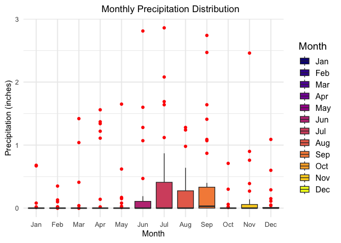
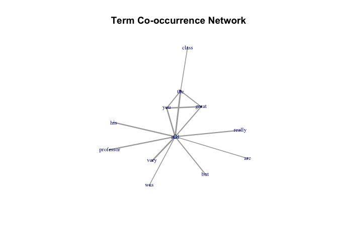
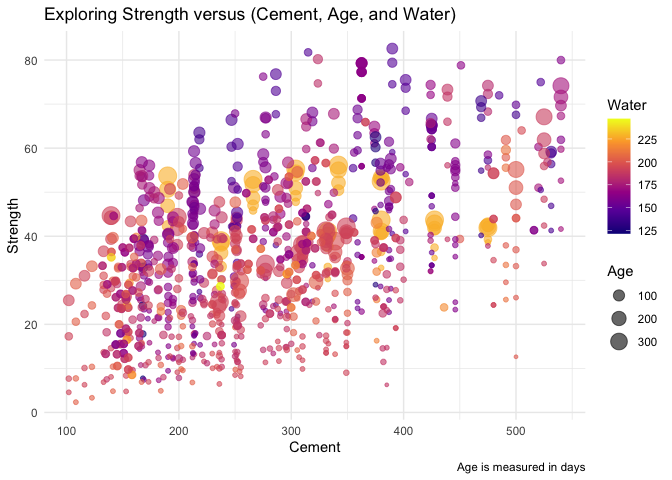

# Data Visualization Project 03

# Introduction
In this exercise you will explore methods to create different types of data visualizations (such as plotting text data, or exploring the distributions of continuous variables).

Data visualization is a critical tool in exploratory data analysis (EDA). It provides an intuitive and effective way to understand data, identify patterns, spot anomalies, and derive insights that might not be immediately apparent through raw data analysis. This project, "Data Visualization for Exploratory Data Analysis," showcases various visualization techniques using weather data from the Florida Climate Center and text data from RateMyProfessors comments.

# Background
The dataset used in this project is obtained from the Florida State University's Florida Climate Center, specifically for a station at Tampa International Airport (TPA) for the year 2022. The data includes daily measurements of weather parameters such as maximum temperature, minimum temperature, and precipitation. Additionally, text data from RateMyProfessors comments is utilized to demonstrate text visualization techniques.

# Methodology
## Data Preparation
1. Reading the Dataset: The weather dataset is read from a CSV file hosted on GitHub.
2. Data Cleaning: The weather data is cleaned by uniting date-related columns into a single date column, converting relevant columns to appropriate data types, and handling missing values.
3. Text Data Preparation: Text data is cleaned by converting comments to lowercase, removing punctuation, and tokenizing into bigrams.

## Visualization Techniques
1. Density Plots: Density plots are created to visualize the distribution of maximum temperatures.
2. Histogram Facets: Histograms are faceted by month to observe monthly variations in temperature distributions.
3. Ridge Plots: Ridge plots are used to display the distribution of maximum temperatures across different months, highlighting density gradients.
4. Boxplots: Boxplots are generated to explore the distribution of precipitation values by month.
5. Text Data Visualizations: Various text visualization techniques are employed, including bigram frequency plots, sentiment analysis, word clouds, and term co-occurrence networks.

## PART 1: Density Plots

Using the dataset obtained from FSU's [Florida Climate Center](https://climatecenter.fsu.edu/climate-data-access-tools/downloadable-data), for a station at Tampa International Airport (TPA) for 2022, attempt to recreate the charts shown below which were generated using data from 2016. You can read the 2022 dataset using the code below: 


```r
library(tidyverse)
library(dplyr)
library(ggplot2)
library(viridis)
library(ggridges)

weather_tpa <- read_csv("https://raw.githubusercontent.com/reisanar/datasets/master/tpa_weather_2022.csv")

sample_n(weather_tpa, 4)
```

```
## # A tibble: 4 × 7
##    year month   day precipitation max_temp min_temp ave_temp
##   <dbl> <dbl> <dbl>         <dbl>    <dbl>    <dbl>    <dbl>
## 1  2022     9     2          1.41       91       73     82  
## 2  2022     3     2          0          78       58     68  
## 3  2022    10     4          0          83       63     73  
## 4  2022    12     4          0          80       61     70.5
```

See https://www.reisanar.com/slides/relationships-models#10 for a reminder on how to use this type of dataset with the `lubridate` package for dates and times (example included in the slides uses data from 2016).

Using the 2022 data: 

(a) Create a plot like the one below:

```r
library(lubridate)
tpa_clean <- weather_tpa %>% 
  unite("doy", year, month, day, sep = "-") %>% 
  mutate(doy = ymd(doy), 
         max_temp = as.double(max_temp), 
         min_temp = as.double(min_temp), 
         precipitation = as.double(precipitation))
tpa_clean
```

```
## # A tibble: 365 × 5
##    doy        precipitation max_temp min_temp ave_temp
##    <date>             <dbl>    <dbl>    <dbl>    <dbl>
##  1 2022-01-01       0             82       67     74.5
##  2 2022-01-02       0             82       71     76.5
##  3 2022-01-03       0.02          75       55     65  
##  4 2022-01-04       0             76       50     63  
##  5 2022-01-05       0             75       59     67  
##  6 2022-01-06       0.00001       74       56     65  
##  7 2022-01-07       0.00001       81       63     72  
##  8 2022-01-08       0             81       58     69.5
##  9 2022-01-09       0             84       65     74.5
## 10 2022-01-10       0             81       64     72.5
## # ℹ 355 more rows
```


Hint: the option `binwidth = 3` was used with the `geom_histogram()` function.

```r
tpa_clean %>%
  mutate(month_name = month.abb[month(doy)]) %>%
  ggplot(aes(x = max_temp, fill = factor(month(doy)))) + 
  geom_histogram(binwidth = 3, color = "black", na.rm = TRUE) +
  scale_fill_viridis_d(option = "D", name = "Month") + 
  facet_wrap(~ month_name, scales = "fixed", ncol = 4) +
  theme_minimal(base_size = 15) +
  theme(
    strip.background = element_rect(fill = "lightgray", color = NA),
    strip.text = element_text(size = 12),
    plot.title.position = "plot",
    plot.title = element_text(hjust = 0.5, size = 14),
    axis.title.x = element_text(size = 12),
    axis.title.y = element_text(size = 12),
    axis.text.x = element_text(size = 10),
    axis.text.y = element_text(size = 10),
    legend.position = "none") +
  labs(
    title = "Max Temperatures Histogram by Month",
    x = "Maximum temperatures",
    y = "Number of Days") 
```

<!-- -->

(b) Create a plot like the one below:


```r
# Create density plot of maximum temperatures by month 
ggplot(tpa_clean, aes(x = max_temp)) +
  geom_density(kernel = "gaussian", bw = 0.5, fill = "gray50", color = "black", alpha = 0.8) +
  labs(title = "Density Plot of Maximum Temperatures at TPA (2022)",
       x = "Maximum temperature",
       y = "Density") +
  theme_minimal() +
  theme(
    plot.title = element_text(hjust = 0.5, size = 14),
    axis.title.x = element_text(size = 12),
    axis.title.y = element_text(size = 12)
  ) +
  scale_y_continuous(limits = c(0, 0.08), breaks = seq(0, 0.08, by = 0.02))
```

<!-- -->

Hint: check the `kernel` parameter of the `geom_density()` function, and use `bw = 0.5`.

### Density Plots
The density plots of maximum temperatures provide insights into the overall temperature distribution at Tampa International Airport. The density plot with kernel smoothing (Gaussian kernel) and bandwidth adjustment (bw = 0.5) helps in visualizing the density of temperatures, revealing the most frequent temperature ranges.

(c) Create a plot like the one below:


Hint: default options for `geom_density()` were used. 

```r
tpa_clean %>%
  mutate(
    month = factor(month(doy)),
    month_name = factor(month.abb[month(doy)], levels = month.abb)
  ) %>%
  ggplot(aes(x = max_temp, fill = month)) + 
  geom_density(color = "black", alpha = 0.7, na.rm = TRUE) +
  scale_fill_viridis_d(option = "D", name = "Month") + 
  facet_wrap(~ month_name, scales = "fixed", ncol = 4) +
  theme_minimal(base_size = 15) +
  theme(
    strip.background = element_rect(fill = "lightgray", color = NA),
    strip.text = element_text(size = 12),
    plot.title.position = "plot",
    plot.title = element_text(hjust = 0.5, size = 14),
    axis.title.x = element_text(size = 12),
    axis.title.y = element_text(size = 12),
    axis.text.x = element_text(size = 10),
    axis.text.y = element_text(size = 10),
    legend.position = "none") +
  labs(
    title = "Max Temperatures Density by Month",
    x = "Maximum temperatures",
    y = "Density") 
```

<!-- -->

### Histogram Facets

Histogram facets by month show the distribution of maximum temperatures for each month. This allows us to compare temperature distributions across different months, identifying patterns such as seasonal variations.

(d) Generate a plot like the chart below:


```r
# Create ridge plot
tpa_clean %>% 
  mutate(month = month(doy, label = TRUE, abbr = FALSE)) %>%
  ggplot(aes(x = max_temp, y = fct_rev(month), fill = ..x..)) +
  geom_density_ridges_gradient(scale = 3,
                               quantile_lines = TRUE,
                               quantiles = 2,
                               alpha = 0.7,
                               color = "black") +
  scale_fill_viridis_c(option = "plasma", name = "Temperature") +
  theme_minimal(base_size = 15) +
  labs(x = "Maximum temperature (in Fahrenheit degrees)", y = "") +
  theme(axis.text = element_text(size = 12),
        axis.title = element_text(size = 14),
        legend.title = element_text(size = 14),
        legend.text = element_text(size = 12)) 
```

```
## Warning: The dot-dot notation (`..x..`) was deprecated in ggplot2 3.4.0.
## ℹ Please use `after_stat(x)` instead.
## This warning is displayed once every 8 hours.
## Call `lifecycle::last_lifecycle_warnings()` to see where this warning was
## generated.
```

```
## Picking joint bandwidth of 1.93
```

<!-- -->

Hint: use the`{ggridges}` package, and the `geom_density_ridges()` function paying close attention to the `quantile_lines` and `quantiles` parameters. The plot above uses the `plasma` option (color scale) for the _viridis_ palette.

### Ridge Plots
Ridge plots are particularly effective in visualizing the distribution of maximum temperatures across months with a gradient color scale. The `plasma` option from the `viridis` palette is used for the gradient, providing a clear and visually appealing representation of temperature variations.

(e) Create a plot of your choice that uses the attribute for precipitation _(values of -99.9 for temperature or -99.99 for precipitation represent missing data)_.


```r
# Removemissing precipitation values
tpa_clean_cleaned <- tpa_clean %>%
  filter(!is.na(precipitation)) %>%
  mutate(
    month = factor(month(doy), labels = month.abb),
    month_name = factor(month(doy), levels = 1:12, labels = month.abb)
  )

# Print boxplot
print(ggplot(tpa_clean_cleaned, aes(x = month_name, y = precipitation)) + 
        geom_boxplot(aes(fill = month_name), outlier.color = "red", outlier.shape = 16, outlier.size = 2) +
        scale_fill_viridis_d(option = "plasma", name = "Month") +
        theme_minimal(base_size = 15) +
        theme(
          strip.background = element_rect(fill = "lightgray", color = NA),
          strip.text = element_text(size = 12),
          plot.title.position = "plot",
          plot.title = element_text(hjust = 0.5, size = 14),
          axis.title.x = element_text(size = 12),
          axis.title.y = element_text(size = 12),
          axis.text.x = element_text(size = 10),
          axis.text.y = element_text(size = 10)
        ) +
        labs(
          title = "Monthly Precipitation Distribution",
          x = "Month",
          y = "Precipitation (inches)"
        ) +
        scale_y_continuous(limits = c(0, NA), breaks = seq(0, 10, by = 1)))
```

<!-- -->

### Boxplots

Boxplots of precipitation by month offer insights into the monthly distribution of precipitation values. This visualization helps in identifying months with higher variability in precipitation and potential outliers.

## PART 2 

> **You can choose to work on either Option (A) or Option (B)**. Remove from this template the option you decided not to work on. 


### Option (A): Visualizing Text Data

Review the set of slides (and additional resources linked in it) for visualizing text data: https://www.reisanar.com/slides/text-viz#1

Choose any dataset with text data, and create at least one visualization with it. For example, you can create a frequency count of most used bigrams, a sentiment analysis of the text data, a network visualization of terms commonly used together, and/or a visualization of a topic modeling approach to the problem of identifying words/documents associated to different topics in the text data you decide to use. 

Make sure to include a copy of the dataset in the `data/` folder, and reference your sources if different from the ones listed below:

- [Billboard Top 100 Lyrics](https://github.com/reisanar/datasets/blob/master/BB_top100_2015.csv)

- [RateMyProfessors comments](https://github.com/reisanar/datasets/blob/master/rmp_wit_comments.csv)

- [FL Poly News Articles](https://github.com/reisanar/datasets/blob/master/flpoly_news_SP23.csv)


(to get the "raw" data from any of the links listed above, simply click on the `raw` button of the GitHub page and copy the URL to be able to read it in your computer using the `read_csv()` function)


```r
# load libraries
library(tidytext)
```

```
## Warning: package 'tidytext' was built under R version 4.3.2
```

```r
library(tm)
```

```
## Warning: package 'tm' was built under R version 4.3.2
```

```
## Loading required package: NLP
```

```
## 
## Attaching package: 'NLP'
```

```
## The following object is masked from 'package:ggplot2':
## 
##     annotate
```

```r
library(wordcloud2)
library(igraph)
```

```
## Warning: package 'igraph' was built under R version 4.3.2
```

```
## 
## Attaching package: 'igraph'
```

```
## The following objects are masked from 'package:lubridate':
## 
##     %--%, union
```

```
## The following objects are masked from 'package:dplyr':
## 
##     as_data_frame, groups, union
```

```
## The following objects are masked from 'package:purrr':
## 
##     compose, simplify
```

```
## The following object is masked from 'package:tidyr':
## 
##     crossing
```

```
## The following object is masked from 'package:tibble':
## 
##     as_data_frame
```

```
## The following objects are masked from 'package:stats':
## 
##     decompose, spectrum
```

```
## The following object is masked from 'package:base':
## 
##     union
```

```r
library(sentimentr)

# Load the dataset
file_path <- "https://raw.githubusercontent.com/reisanar/datasets/master/rmp_wit_comments.csv"
data <- read_csv(file_path)
```

```
## Rows: 18 Columns: 2
```

```
## ── Column specification ────────────────────────────────────────────────────────
## Delimiter: ","
## chr (2): course, comments
## 
## ℹ Use `spec()` to retrieve the full column specification for this data.
## ℹ Specify the column types or set `show_col_types = FALSE` to quiet this message.
```

```r
sample_n(data, 5)
```

```
## # A tibble: 5 × 2
##   course   comments                                                             
##   <chr>    <chr>                                                                
## 1 MATH430  Great Professor,  He is a really nice guy. Wants students to achieve…
## 2 MATH430  He is an awesome professor! I'm not one for math at all and frankly …
## 3 MATH2025 He is a great professor. Calculus has always been sort of scary to m…
## 4 MATH430  Best math teacher you will ever have. He is the man, plain and simpl…
## 5 MATH1900 He is very enthusiastic to help students. His course content is orga…
```


```r
# Clean the comments
data <- data %>%
  mutate(comments_clean = str_to_lower(comments) %>%
           str_replace_all("[^a-zA-Z0-9 ]", ""))

# Tokenize 
bigrams <- data %>%
  unnest_tokens(bigram, comments_clean, token = "ngrams", n = 2)

# Remove stopwords
data(stop_words)
bigrams <- bigrams %>%
  separate(bigram, c("word1", "word2"), sep = " ") %>%
  filter(!word1 %in% stop_words$word, !word2 %in% stop_words$word) %>%
  unite(bigram, word1, word2, sep = " ")


bigram_counts <- bigrams %>%
  count(bigram, sort = TRUE)

# Print top 10 bigrams
top_bigrams <- head(bigram_counts, 10)

# Plot
ggplot(top_bigrams, aes(x = reorder(bigram, n), y = n)) +
  geom_bar(stat = "identity", fill = "purple") +
  labs(title = "Top 10 Bigrams in RateMyProfessors Comments",
       x = "Bigrams", y = "Frequency") +
  coord_flip()  
```

<!-- -->

### Bigram Frequency Plot

The bigram frequency plot shows the most common bigrams in the RateMyProfessors comments, providing an overview of commonly occurring word pairs. This helps in understanding prevalent themes and topics in the comments.


```r
# Clean and tokenize the text data
tidy_comments <- data %>%
  unnest_tokens(word, comments) %>%
  filter(!word %in% stop_words$word) %>%
  filter(str_detect(word, "[a-z]"))

# Perform sentiment analysis using the Bing lexicon
bing_sentiments <- tidy_comments %>%
  inner_join(get_sentiments("bing")) %>%
  count(word, sentiment, sort = TRUE) %>%
  ungroup()
```

```
## Joining with `by = join_by(word)`
```

```r
# Visualize the sentiment scores
bing_sentiments %>%
  group_by(sentiment) %>%
  top_n(10) %>%
  ungroup() %>%
  mutate(word = reorder(word, n)) %>%
  ggplot(aes(word, n, fill = sentiment)) +
  geom_col(show.legend = FALSE) +
  facet_wrap(~ sentiment, scales = "free_y") +
  labs(
    title = "Top 10 Positive and Negative Words in Comments",
    x = NULL,
    y = "Frequency"
  ) +
  coord_flip() +
  theme_minimal(base_size = 15) +
  theme(
    plot.title = element_text(hjust = 0.5, size = 16),
    axis.title.x = element_text(size = 14),
    axis.title.y = element_text(size = 14),
    axis.text.x = element_text(size = 10),
    axis.text.y = element_text(size = 10)
  )
```

```
## Selecting by n
```

<!-- -->

### Sentiment Analysis

Sentiment analysis using the Bing lexicon identifies the most frequent positive and negative words in the comments. This visualization helps in understanding the overall sentiment of the comments and identifying key factors contributing to positive or negative feedback.


```r
# Clean and tokenize text data
tidy_comments <- data %>%
  unnest_tokens(word, comments) %>%
  filter(!word %in% stop_words$word) %>%
  filter(str_detect(word, "[a-z]"))

# Count the most frequent words
word_counts <- tidy_comments %>%
  count(word, sort = TRUE)

# Create the word cloud
wordcloud2(word_counts, size = 1.5, color = 'random-light', backgroundColor = 'black')
```

```{=html}
<div class="wordcloud2 html-widget html-fill-item" id="htmlwidget-775d2695ff275629c64c" style="width:672px;height:480px;"></div>
<script type="application/json" data-for="htmlwidget-775d2695ff275629c64c">{"x":{"word":["professor","class","lectures","easy","material","understand","calc","helpful","math","students","difficult","grade","teacher","classes","concepts","guy","hard","makes","pre","responsive","algebra","attention","awesome","due","easily","examples","found","funny","homework","hw","lecture","linear","online","pay","powerpoints","semester","taking","test","tests","time","achieve","anxious","approach","attendance","boring","brain","bumped","calculus","challenging","clarify","classroom","college","communicating","communication","communicator","concise","confident","content","convey","cool","crappy","current","cut","deal","diff","dude","easiest","email","emailing","emails","embed","enjoyable","enjoyed","entertained","enthusiastic","eqs","events","exams","expect","explaining","explains","extra","extremely","favorite","feel","follow","frankly","fun","games","grading","grasp","guys","happening","heads","heartbeat","helped","hes","hitting","homeworks","hour","humor","jokes","knowledge","learn","learned","learning","left","lot","loved","loves","main","major","materials","mathematic","mathematics","meet","missed","mixes","multivariable","nice","notes","occasional","office","organized","painless","pass","person","plain","pop","powerpoint","prep","pretest","pretty","professors","quick","quiz","quiz's","quizzes","real","reason","relates","required","responses","rocks","scary","sends","short","simple","skills","smart","sort","strong","struggle","struggling","stuff","succeed","suggest","suggested","takes","talented","taught","teaching","thinking","touches","tough","trouble","understandable","understanding","week","wentworth","withdrew","wonderful","world","write"],"freq":[14,11,8,6,6,6,5,5,5,5,4,4,4,3,3,3,3,3,3,3,2,2,2,2,2,2,2,2,2,2,2,2,2,2,2,2,2,2,2,2,1,1,1,1,1,1,1,1,1,1,1,1,1,1,1,1,1,1,1,1,1,1,1,1,1,1,1,1,1,1,1,1,1,1,1,1,1,1,1,1,1,1,1,1,1,1,1,1,1,1,1,1,1,1,1,1,1,1,1,1,1,1,1,1,1,1,1,1,1,1,1,1,1,1,1,1,1,1,1,1,1,1,1,1,1,1,1,1,1,1,1,1,1,1,1,1,1,1,1,1,1,1,1,1,1,1,1,1,1,1,1,1,1,1,1,1,1,1,1,1,1,1,1,1,1,1,1,1,1,1,1,1,1,1],"fontFamily":"Segoe UI","fontWeight":"bold","color":"random-light","minSize":0,"weightFactor":19.28571428571428,"backgroundColor":"black","gridSize":0,"minRotation":-0.7853981633974483,"maxRotation":0.7853981633974483,"shuffle":true,"rotateRatio":0.4,"shape":"circle","ellipticity":0.65,"figBase64":null,"hover":null},"evals":[],"jsHooks":{"render":[{"code":"function(el,x){\n                        console.log(123);\n                        if(!iii){\n                          window.location.reload();\n                          iii = False;\n\n                        }\n  }","data":null}]}}</script>
```
### Word Cloud
A word cloud visualization displays the most frequent words in the comments, providing a quick and visually appealing summary of common terms used by students.


```r
data <- data %>%
  mutate(comments_clean = str_to_lower(comments) %>%
           str_replace_all("[^a-zA-Z0-9 ]", ""))

corpus <- Corpus(VectorSource(data$comments_clean))
tdm <- DocumentTermMatrix(corpus)

tdm_matrix <- as.matrix(tdm)
co_occurrence_matrix <- t(tdm_matrix) %*% tdm_matrix
diag(co_occurrence_matrix) <- 0  

threshold <- 15
co_occurrence_matrix[co_occurrence_matrix <= threshold] <- 0

graph <- graph_from_adjacency_matrix(co_occurrence_matrix, mode = "undirected", weighted = TRUE, diag = FALSE)

graph <- simplify(graph, remove.multiple = TRUE, remove.loops = TRUE)
graph <- delete.vertices(graph, which(degree(graph) == 0))
```

```
## Warning: `delete.vertices()` was deprecated in igraph 2.0.0.
## ℹ Please use `delete_vertices()` instead.
## This warning is displayed once every 8 hours.
## Call `lifecycle::last_lifecycle_warnings()` to see where this warning was
## generated.
```

```r
# Plot the network
plot(graph, 
     layout = layout.fruchterman.reingold, 
     vertex.label = V(graph)$name, 
     vertex.size = degree(graph)/2, 
     vertex.color = "lightblue", 
     vertex.label.cex = 0.7,  
     edge.width = E(graph)$weight/10,  
     main = "Term Co-occurrence Network")
```

<!-- -->

### Term Co-occurrence Network

The term co-occurrence network visualizes relationships between commonly occurring terms, highlighting clusters of related words and providing insights into topics frequently discussed together.

### Option (B): Data on Concrete Strength 

Concrete is the most important material in **civil engineering**. The concrete compressive strength is a highly nonlinear function of _age_ and _ingredients_. The dataset used here is from the [UCI Machine Learning Repository](https://archive.ics.uci.edu/ml/index.php), and it contains 1030 observations with 9 different attributes 9 (8 quantitative input variables, and 1 quantitative output variable). A data dictionary is included below: 


Variable                      |    Notes                
------------------------------|-------------------------------------------
Cement                        | kg in a $m^3$ mixture             
Blast Furnace Slag            | kg in a $m^3$ mixture  
Fly Ash                       | kg in a $m^3$ mixture             
Water                         | kg in a $m^3$ mixture              
Superplasticizer              | kg in a $m^3$ mixture
Coarse Aggregate              | kg in a $m^3$ mixture
Fine Aggregate                | kg in a $m^3$ mixture      
Age                           | in days                                             
Concrete compressive strength | MPa, megapascals


Below we read the `.csv` file using `readr::read_csv()` (the `readr` package is part of the `tidyverse`)


```r
concrete <- read_csv("../data/concrete.csv", col_types = cols())
```


Let us create a new attribute for visualization purposes, `strength_range`: 


```r
new_concrete <- concrete %>%
  mutate(strength_range = cut(Concrete_compressive_strength, 
                              breaks = quantile(Concrete_compressive_strength, 
                                                probs = seq(0, 1, 0.2))) )
```


```r
sample_n(new_concrete, 5)
```

```
## # A tibble: 5 × 10
##   Cement Blast_Furnace_Slag Fly_Ash Water Superplasticizer Coarse_Aggregate
##    <dbl>              <dbl>   <dbl> <dbl>            <dbl>            <dbl>
## 1   199.               132.       0  192                 0             978.
## 2   133                200        0  192                 0             927.
## 3   310                143.       0  168.               10             914.
## 4   305                  0      100  196                10             959 
## 5   273.               182.       0  186.                0            1012.
## # ℹ 4 more variables: Fine_Aggregate <dbl>, Age <dbl>,
## #   Concrete_compressive_strength <dbl>, strength_range <fct>
```

1. Explore the distribution of 2 of the continuous variables available in the dataset. Do ranges make sense? Comment on your findings.

```r
# Plot the distribution of Cement
ggplot(concrete, aes(x = Cement)) +
  geom_histogram(bins = 30, fill = "#e67f83", color = "black") +
  labs(title = "Distribution of Cement",
       x = "Cement (kg in a m^3 mixture)",
       y = "Frequency")
```

<!-- -->

```r
# Plot the distribution of Water
ggplot(concrete, aes(x = Water)) +
  geom_histogram(bins = 30, fill = "#346888", color = "black") +
  labs(title = "Distribution of Water",
       x = "Water (kg in a m^3 mixture)",
       y = "Frequency")
```

<!-- -->

_*Comment on the findings:*_

  **Cement**: The distribution of Cement shows that it ranges from approximately 100 to 550 kg in a cubic meter mixture. The distribution appears to be relatively normal with a peak around 200-300 kg.
  
  **Water**: The distribution of Water ranges from around 120 to 250 kg in a cubic meter mixture. The distribution is slightly skewed to the right with a peak around 160-180 kg.

2. Use a _temporal_ indicator such as the one available in the variable `Age` (measured in days). Generate a plot similar to the one shown below. Comment on your results.


```r
# create the plot
ggplot(new_concrete, aes(x = Age, y = Concrete_compressive_strength, fill = strength_range)) +
  geom_boxplot() +
  scale_fill_brewer(palette = "Set3", name = "Strength Range") +
  labs(title = "Compressive Strength of Concrete by Age",
       x = "Age (in days)",
       y = "Compressive Strength (in MPa)") +
  theme_minimal()
```

<!-- -->

3. Create a scatterplot similar to the one shown below. Pay special attention to which variables are being mapped to specific aesthetics of the plot. Comment on your results. 


```r
# create scatterplot
ggplot(concrete, aes(x = Cement, y = Concrete_compressive_strength, size = Age, color = Water)) +
  geom_point(alpha = 0.6) +
  scale_size_continuous(name = "Age") +
  scale_color_viridis_c(name = "Water", option = "plasma") +
  labs(title = "Exploring Strength versus (Cement, Age, and Water)",
       x = "Cement",
       y = "Strength",
       caption = "Age is measured in days") +
  theme_minimal()
```

<!-- -->

# Key Strategy
For this project is to leverage a variety of visualization techniques to gain a comprehensive understanding of the dataset. By using density plots, histograms, ridge plots, and boxplots for weather data, and bigram frequency plots, sentiment analysis, word clouds, and term co-occurrence networks for text data, we can uncover patterns, trends, and insights that inform our understanding of the data.

# Conclusion
This project demonstrates the power of data visualization in exploratory data analysis. Through various visualization techniques, we gain valuable insights into weather patterns at Tampa International Airport and common themes in RateMyProfessors comments. These visualizations not only enhance our understanding of the data but also provide a foundation for further analysis and decision-making. By employing a diverse set of visualization tools, we can effectively communicate data-driven insights and support informed decisions.
